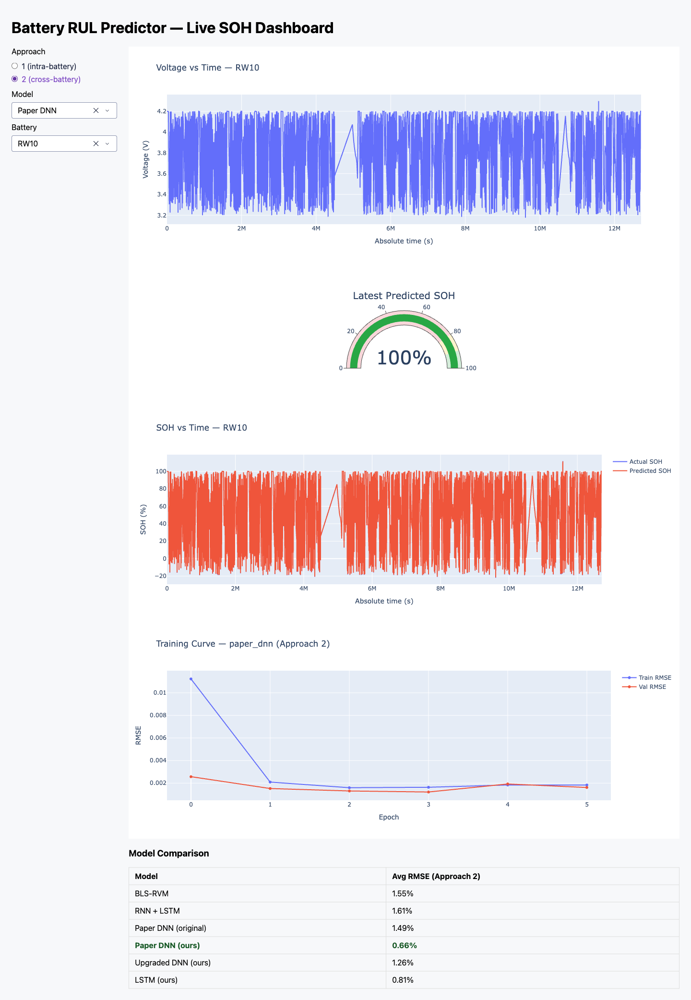

# Battery RUL Predictor

Predicting State of Health and Remaining Useful Life of Li-ion batteries using deep learning, built on the NASA Randomized Battery Usage 1: Random Walk dataset.

This project is under active development. See `CHECKPOINTS.md` for build progress.

## Dashboard



```bash
python scripts/precompute_predictions.py  # one-time, generates data/processed/predictions/
python scripts/serve.py                   # opens http://localhost:8050
```
